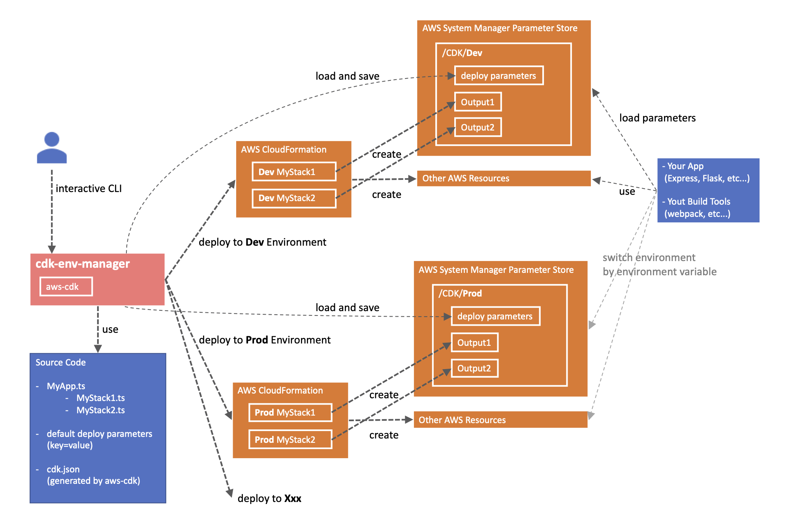

# cdk-env-manager

[](https://badge.fury.io/js/cdk-env-manager)
[](https://opensource.org/licenses/MIT)
[](https://twitter.com/intent/tweet?text=Wow:&url=https%3A%2F%2Fgithub.com%2Fmasahirompp%2Fcdk-env-manager)

aws-cdk で複数環境（production, development, etc...）を管理するための CLI ツールです。
TypeScript 対応。

<https://qiita.com/ronny/items/c53c79a770fd12ae6786>

- デプロイ時の Parameter や Output は、AWS の Parameter Store で管理します。そのため、

  - config.dev.json など、環境毎にファイルを作成する必要はありません。
  - パラメータが増える毎に、環境変数や aws-cdk の Context を増やす必要はありません。
  - 機密情報を Git で管理する必要がありません。

- `cdk diff`してから`cdk deploy`するなど、デプロイ時の手順が統一されます。



## Demo

デプロイ時の interactive CLI のイメージ


## Install

```sh
yarn add aws-sdk @aws-cdk/core @aws-cdk/aws-ssm # install peer dependencies
yarn add cdk-env-manager
```

## Usage

### initialize

cdk プロジェクトを作成しておいてください。

```sh
cdk init --language typescript
```

```json
// cdk.json
{
  "app": "node -r dotenv/config -r ts-node/register cdk/MyApp.ts"
}
```

### Stack のコーディング

- cdk-env-manager から CdkStackBase を import して継承してください。
- createResources メソッドを実装してください。

```typescript
// S3Stack.ts
import * as cdk from '@aws-cdk/core'
import * as s3 from '@aws-cdk/aws-s3'
import { CdkStackBase } from 'cdk-env-manager'

type Input = { removalPolicy: cdk.RemovalPolicy }
type Export = { myBucketArn: string }

export class S3Stack extends CdkStackBase<Input, Export> {
  createResources() {
    const myBucket = new s3.Bucket(this, this.name('MyBucket'), {
      removalPolicy: this.props.removalPolicy,
    })

    this.createOutputsSsmParameters({ myBucketName: myBucket.bucketName })

    return {
      myBucketArn: myBucket.bucketArn,
    }
  }
}
```

- Input はこの Stack が受け取るパラメータです。
- Export はこの Stack が出力するパラメータです。他の Stack に渡したい場合に使います。
- createOutputsSsmParameters(...)は値を SSM のパラメータストアに書き出します。アプリ側から参照したい設定値などを、SSM に書き出してください。（アプリ側からの参照方法は後述）
- this.name("MyBucket")は、"DevMyBucket"のように環境名の prefix をつけてくれるヘルパーメソッドです。

### App のコーディング

複数の Stack をまとめる cdk app を作成します。

- cdk-env-manager から CdkAppBase を import して継承してください。
- createStacks メソッドを実装してください。
- 末尾２行は必須です。

```typescript
// MyApp.ts
import * as cdk from '@aws-cdk/core'
import { CdkAppBase } from 'cdk-env-manager'
import { RoleStack } from './stacks/RoleStack'
import { S3Stack } from './stacks/S3Stack'

type DeployParameter = { removalPolicy: cdk.RemovalPolicy }

export class MyApp extends CdkAppBase<DeployParameter> {
  async createStacks() {
    const s3Stack = new S3Stack(this, 'S3Stack', {
      removalPolicy: this.deployParameters.removalPolicy,
    })

    new RoleStack(this, 'RoleBucket', {
      bucketArn: s3Stack.exports.myBucketArn,
    })
  }
}

const app = new MyApp()
app.synth()
```

詳細は example フォルダを参照してください。

### Default Parameter の定義

デプロイ時にパラメータを渡すことができます。パラメータは環境毎に設定できます。
パラメータの既定値をファイルに記載しておく必要があります。
プロジェクトのルートに cdk.parameters.default.env を作成し、パラメータの既定値を key=value 形式で指定してください。

```txt
REMOVAL_POLICY=retain
XXX=xxx
```

### 環境変数の設定

デプロイ時に必要な以下の環境変数を設定してください。aws-cdk が参照する環境変数となります。

- AWS_DEFAULT_REGION
- AWS_ACCESS_KEY_ID と AWS_SECRET_ACCESS_KEY のペア、または AWS_PROFILE

### デプロイ実行

```sh
npx cdk-env-manager

# .envファイルを読み込んで実行する場合は
# npx -n '-r dotenv/config' cdk-env-manager
```

詳細は以下を参照。

<https://qiita.com/ronny/items/c53c79a770fd12ae6786#デプロイ方法>

## CLI OPTIONS

aws-cdk の cli options が使用できます。
`cdk diff`, `cdk deploy`実行時に指定された option を渡します。

```sh
npx cdk-env-manager --trace # Print trace for stack warnings
```

## アプリケーションから Stack Outputs の参照

### with webpack

SSM に書き出された設定値を、webpack で読み込んでビルドする方法です。

環境変数`CDK_ENV_KEY`に、利用したい環境のキーを設定してください。

```typescript
// webpack.config.ts
import webpack from 'webpack'
import { loadStackParameters } from 'cdk-env-manager/util'

const configFunction: () => Promise<webpack.Configuration> = async () => {
  // load stack parameters from ssm
  const params = await loadStackParameters()

  return {
    entry: 'src/index.ts',
    // ...省略
    plugins: [
      new webpack.DefinePlugin({
        ...Object.keys(params).reduce(
          (payload, key) => ({ ...payload, [key]: JSON.stringify(params[key]) }),
          {}
        ),
      }),
    ],
  }
}

export default configFunction
```

```sh
# .env
AWS_DEFAULT_REGION=ap-northeast-1
AWS_PROFILE=my-profile
CDK_ENV_KEY=Dev # SSMから取得する環境のKEYを指定
```

```json
// package.json
{
  "scripts": {
    "build": "node -r dotenv/config -r ts-node/register webpack.config.ts"
  }
}
```

## Singleton Stack

HOSTED ZONE など、各環境で共通で利用したいリソースは、`CdkSingletonStackBase`を継承して Stack を作成してください。
各環境でこの Stack を共有して利用します。

## 1 つの AWS アカウント内に複数の CdkApp を持ちたい場合

環境変数`CDK_APP_KEY`を設定することで、
AWS アカウント内で参照する CdkApp を切り替えることができます。

## License

MIT
